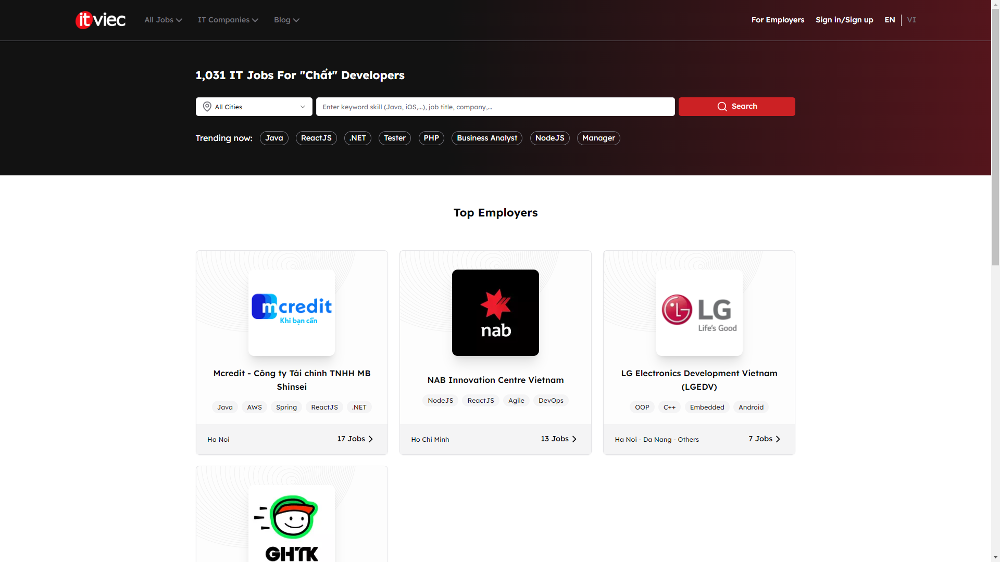
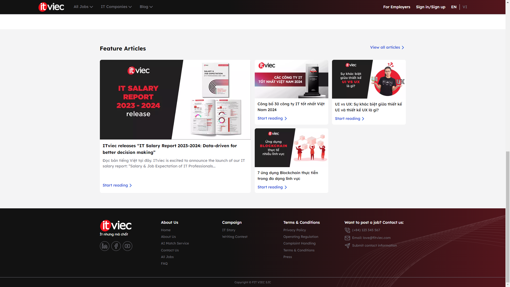

# React + Vite Project

This project uses Vite and React for fast development and efficient module bundling. It also includes ESLint for code linting.

## Prerequisites

Before running this project, you should have [Node.js](https://nodejs.org/) and [npm](https://www.npmjs.com/) installed on your machine.

## Installation

```bash
git clone https://github.com/pdqdat/demo-fitviec
cd demo-fitviec
npm install
npm run dev
```

## Preview




